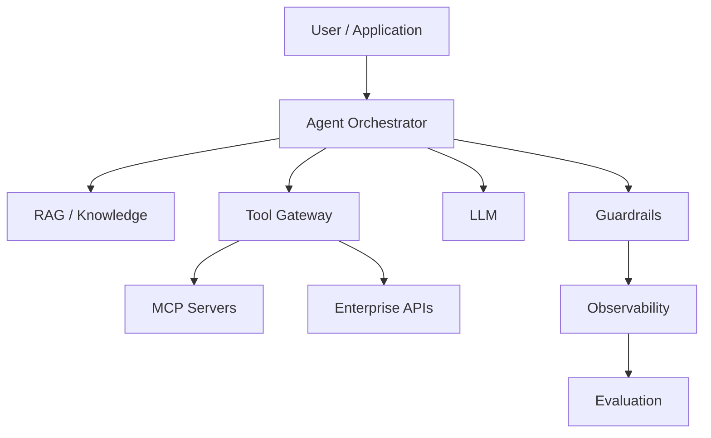
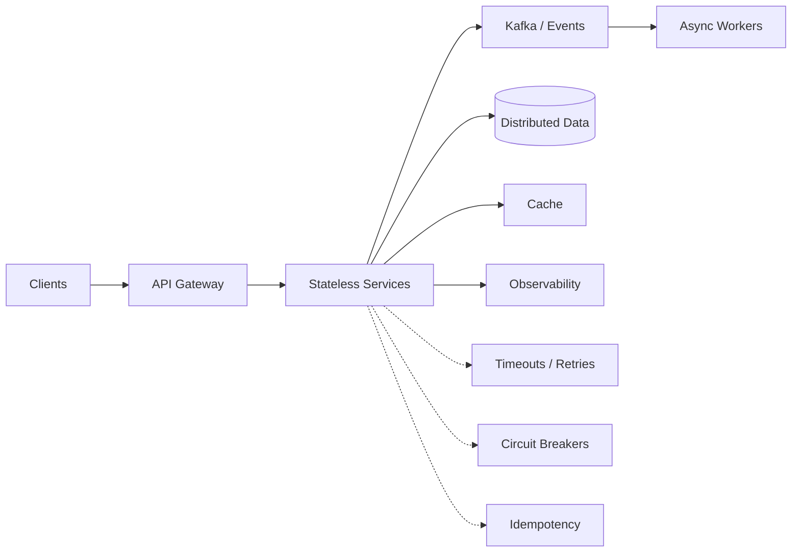

# Hi, I'm Rishi Srivastav 👋

  <strong>Principal Software Engineer · Distributed Systems · Cloud Architecture · Agentic AI</strong>

  I build resilient, high-scale backend platforms and production AI systems — from distributed APIs and event-driven systems to RAG, agents, and MCP.

  
  
  

---

## 👨‍💻 About Me

- Principal Software Engineer with **11+ years of experience** building backend and distributed systems.
- Strong in **Java, Spring Boot, AWS, Kafka, Kubernetes, PostgreSQL, Oracle, and Cassandra**.
- Experienced in **high-throughput APIs, event-driven architecture, multi-region resilience, cloud modernization, and platform engineering**.
- Building production-oriented **Agentic AI, RAG, MCP, evaluation, observability, and guardrail** patterns.
- I enjoy moving between **architecture and implementation**: system design, difficult technical decisions, POCs, performance work, and production debugging.

## 🏗️ Engineering Focus

| Area | Focus |
|---|---|
| Distributed Systems | High-throughput APIs, microservices, consistency, idempotency, retries, circuit breakers |
| Cloud Architecture | AWS, multi-region systems, serverless, containers, Kubernetes, IaC |
| Event-Driven Systems | Kafka, queues, async workflows, outbox, DLQs, reconciliation |
| Backend Engineering | Java, Spring Boot, Quarkus, REST APIs, data-intensive services |
| Platform Engineering | API standards, reusable capabilities, observability, reliability |
| Agentic AI | Agents, RAG, MCP, tool calling, memory, evaluation, guardrails |
| Production Engineering | Performance, incidents, failure analysis, monitoring, operational readiness |

## 🧰 Technology

**Backend:** Java · Spring Boot · Quarkus · Python · REST · Kafka  
**AWS:** API Gateway · Lambda · SQS · SNS · Aurora · DynamoDB · CloudFormation  
**Data:** PostgreSQL · Oracle · Cassandra · Redis  
**Platform:** Kubernetes · OpenShift · Docker · CI/CD · IaC · Observability  
**AI:** Amazon Bedrock · Claude · RAG · MCP · Agentic AI · Evaluation · Guardrails

## 🤖 Agentic AI

### Production principles

- **Deterministic first** — use conventional software where deterministic logic is sufficient.
- **Least privilege** — agents receive only the tools and permissions they need.
- **Ground before generate** — retrieve authoritative context before consequential answers.
- **Typed boundaries** — validate tool inputs and outputs.
- **Fail closed** — unsafe or unauthorized actions should stop.
- **Bounded autonomy** — use approvals and policy checks for consequential actions.
- **Observe every step** — trace retrieval, prompts, tools, latency, errors, and cost.
- **Evaluate continuously** — measure groundedness, task success, tool-call accuracy, regressions, latency, and cost.

## ⭐ Featured Projects

- **[Agentic AI Engineering Playbook](https://github.com/Rishi-Srivastav/agentic-ai-engineering-playbook)** — production patterns for agents, RAG, MCP, guardrails, evaluation, observability, and debugging.
- **[Embabel Agent Examples](https://github.com/Rishi-Srivastav/embabel-agent-examples)** — Java/Kotlin examples for agent workflows, tools, MCP, multi-LLM research, and human-in-the-loop patterns.
- **[Awesome System Design Resources](https://github.com/Rishi-Srivastav/awesome-system-design-resources)** — curated distributed-systems and system-design resources.
- **[Python → AI](https://github.com/Rishi-Srivastav/python-to-ai)** — progression from Python fundamentals to APIs, async programming, RAG, and agents.
- **[NeetCode Submissions](https://github.com/Rishi-Srivastav/neetcode-submissions)** — DSA practice and interview problem-solving patterns.
- **[Personal Website](https://github.com/Rishi-Srivastav/Rishi-srivastav.github.io)** — GitHub Pages portfolio.

## 📐 Distributed Systems Mindset

I care about what happens **after the happy path**:

**timeouts · retries · duplicate messages · partial failure · backpressure · consistency · ordering · schema evolution · disaster recovery · observability · security · cost**

## 📊 GitHub

  
  

  

## 🔭 Currently Exploring

- Production **Agentic AI** architectures
- **MCP** servers and secure tool gateways
- RAG quality, evaluation, memory, and observability
- High-scale **distributed systems**
- Cloud-native platform architecture
- AI developer tooling

## 🤝 Let's Connect

  
  
  

<i>Build systems that scale. Design for failure. Keep learning.</i>

